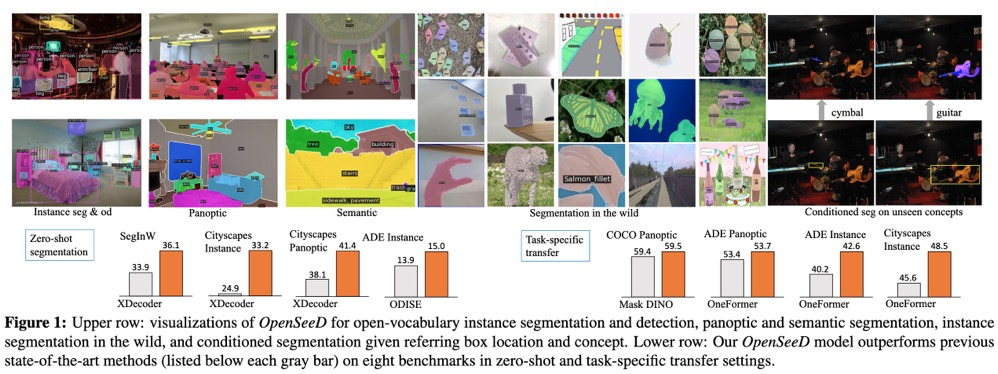
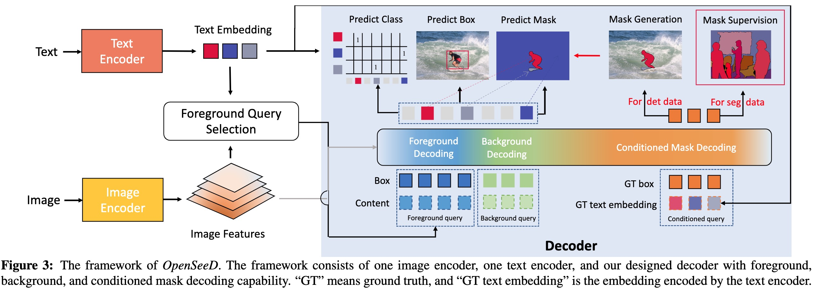
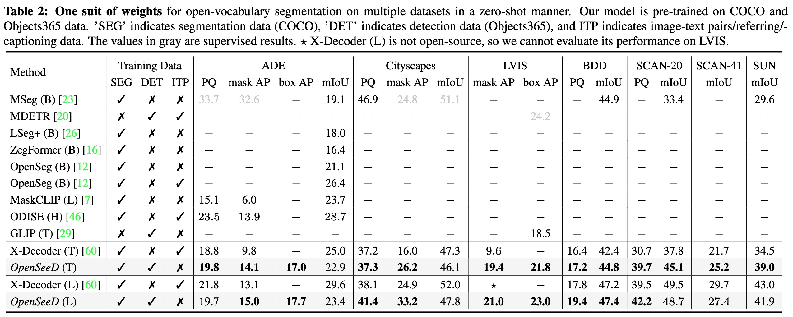
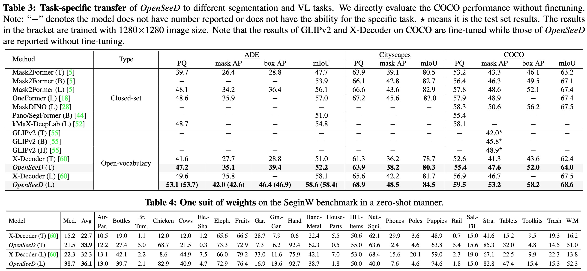

# OpenSeeD
[](https://paperswithcode.com/sota/panoptic-segmentation-on-coco-minival?p=a-simple-framework-for-open-vocabulary)
[](https://paperswithcode.com/sota/panoptic-segmentation-on-ade20k-val?p=a-simple-framework-for-open-vocabulary)
[](https://paperswithcode.com/sota/instance-segmentation-on-ade20k-val?p=a-simple-framework-for-open-vocabulary)
[](https://paperswithcode.com/sota/instance-segmentation-on-cityscapes-val?p=a-simple-framework-for-open-vocabulary)

This is the official implementation of the paper "[A Simple Framework for Open-Vocabulary Segmentation and Detection](https://arxiv.org/pdf/2303.08131.pdf)".

https://user-images.githubusercontent.com/34880758/225408795-d1e714e0-cfc8-4466-b052-045d54409a1d.mp4

You can also find the more detailed demo at [video link on Youtube](https://www.youtube.com/watch?v=z4gsQw2n7iM).

:point_right: **[New] demo code is available**
:point_right: **[New] OpenSeeD has been accepted to ICCV 2023! training code is available!**

### :rocket: Key Features
- A Simple Framework for Open-Vocabulary Segmentation and Detection.
- Support interactive segmentation with box input to generate mask.

### :bulb: Installation
```sh
pip3 install torch==1.13.1 torchvision==0.14.1 --extra-index-url https://download.pytorch.org/whl/cu113
python -m pip install 'git+https://github.com/MaureenZOU/detectron2-xyz.git'
pip install git+https://github.com/cocodataset/panopticapi.git
python -m pip install -r requirements.txt
export DATASET=/pth/to/dataset
```
Download the pretrained checkpoint from [here](https://github.com/IDEA-Research/OpenSeeD/releases/download/openseed/model_state_dict_swint_51.2ap.pt).
### :bulb: Demo script
```sh
python demo/demo_panoseg.py evaluate --conf_files configs/openseed/openseed_swint_lang.yaml  --image_path images/animals.png --overrides WEIGHT /path/to/ckpt/model_state_dict_swint_51.2ap.pt
```
:fire: Remember to **modify the vocabulary**  `thing_classes` and `stuff_classes` in `demo_panoseg.py`  if your want to segment open-vocabulary objects.

**Evaluation on coco**
```sh
python train_net.py --original_load --eval_only --num-gpus 8 --config-file configs/openseed/openseed_swint_lang.yaml MODEL.WEIGHTS=[/path/to/lang/weight](https://github.com/IDEA-Research/OpenSeeD/releases/download/openseed/model_state_dict_swint_51.2ap.pt)
```
You are expected to get `55.4` PQ.
### Training OpenSeeD baseline
**Training on coco**
```sh
python train_net.py --num-gpus 8 --config-file configs/openseed/openseed_swint_lang.yaml --lang_weight [/path/to/lang/weight](https://github.com/IDEA-Research/OpenSeeD/releases/download/training/model_state_dict_only_language.pt)
```
**Training on coco+o365**
```sh
python train_net.py --num-gpus 8 --config-file configs/openseed/openseed_swint_lang_o365.yaml --lang_weight [/path/to/lang/weight](https://github.com/IDEA-Research/OpenSeeD/releases/download/training/model_state_dict_only_language.pt)
```


### :unicorn: Model Framework

### :volcano: Results
Results on open segmentation

Results on task transfer and segmentation in the wild



### <a name="CitingOpenSeeD"></a>Citing OpenSeeD

If you find our work helpful for your research, please consider citing the following BibTeX entry.

```BibTeX
@article{zhang2023simple,
  title={A Simple Framework for Open-Vocabulary Segmentation and Detection},
  author={Zhang, Hao and Li, Feng and Zou, Xueyan and Liu, Shilong and Li, Chunyuan and Gao, Jianfeng and Yang, Jianwei and Zhang, Lei},
  journal={arXiv preprint arXiv:2303.08131},
  year={2023}
}
```

